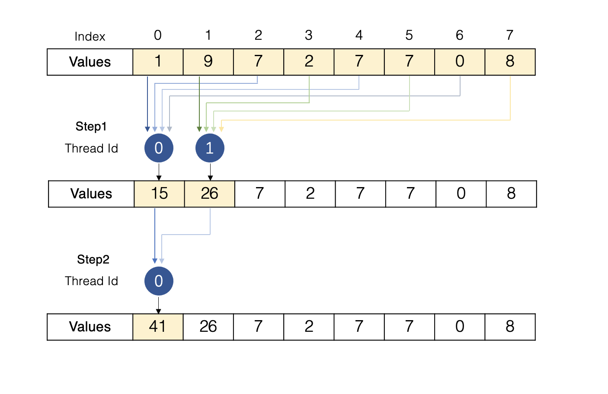

# Optimized-Cuda-SDOT-Kernel-on-NVIDIA-Turing-GPUs
An optimized CUDA SDOT(Single Floating-Point DOT Product) kernel on NVIDIA Turing GPUs. Better performance than the cuBLAS kernel.
## Description

This code demonstrates a usage of cuBLAS `SDOT` function to apply the dot product to vector x and y

Optimization of operations like SDOT in High-Performance Computing (HPC) mainly revolves around reducing data movement. This is achieved on GPU platforms by leveraging parallelism, reusing data at the cache/register level, and utilizing manual prefetching. 

By testing, this GPU-optimized kernel boosts the efficiency of the SDOT operation by minimizing data movement, which runs faster than the cuBLAS SDOT kernel and the traditional sequential reduction method.

Any discussions are welcome, please send them to yiliuli2006@gmail.com

#Logic
### Kernel 0 
The `kernel 0` is the CuBLAS example kernel for the SDOT calculation. 

### Kernel 1 
The `kernel 1` uses the traditional sequential reduction. Specifically, after multiplying numbers on each position, this kernel adds up two products at a thread in a time, with each stride `Size of Vector / 2`. 
Shown as below. 


### Kernel 2
The `kernel 1` uses a optimised sequential reduction. In specific, after multiplying numbers on each position, the `kernel 2` adds up four products at a thread in a time, with each stride `Size of Vector / 4`. 
Shown as graph below. 



In comparison, `kernel 2` requires less data movement, whereas the time of iteration is shortened, more tasks are allocated to the GPU computing unit. As a consequense, enhanced the performance limit.


# Performance
The following test results was produced on:
- GCC Version 4.8.5
- CentOS Linux 7.9.2009
- 8 Tesla T4 with CUDA Version 11.4

### Performance Comparison Between CuBLAS and Kernel 1 


### Performance Comparison Between CuBLAS and Kernel 2 


### Performance Comparison Between Kernel1 and Kernel 2


As can be seen, the performance of the `kernel 2` is always better than it of `kernel 1`. The deivation of this consequence is that the quantity of computations in `kernel 2` is high while the memory bandwidth is high as well, which is a balanced point between the two "roof" to reach the highest FLOPS.


# How to run
###Run on Linux
- Clone the code.
- Build command in terminal.
    ```bash
$ mkdir build
$ cd build
$ cmake ..
$ make
```
- Run the executable file.
```bash
  ./cuda_sdot
```

###Run on Windows
- Clone the code.
- Build command in terminal.
```bash
$ mkdir build
$ cd build
$ cmake -DCMAKE_GENERATOR_PLATFORM=x64 ..
$ Open cublas_examples.sln project in Visual Studio and build
```
- Run the executable file.
```bash
  ./cuda_sdot
```


##How to use
- Enter kernel number (0 for CuBLAS kernel).
```
Kernel Number (0 for CuBLAS): 2
```
- Enter block-size ( 64 / 256 recommended ).
```
Block Size: 256
```

- Execution time and Performance will be printed

```
------------------------
Length of Vector = 10000
Time spent: 0.053248 ms
Performance: 0.375582 GFLOPS
========================

------------------------
Length of Vector = 90000
Time spent: 0.024320 ms
Performance: 7.401274 GFLOPS
========================

...

...

------------------------
Length of Vector = 24010000
Time spent: 0.749312 ms
Performance: 64.085454 GFLOPS
========================

------------------------
Length of Vector = 26010000
Time spent: 0.802816 ms
Performance: 64.796916 GFLOPS
========================
```


# Notices 
- There are two kernels for the kernel 2, because when the block size is **NOT** the `4 to the power of z` where `z is a positive integer`, then the last summation have to be strided 1, therefore the kernel have to be seperatly written for each case of the block size.

- The performance is sometimes higher than the theoretical roofline, there are some possible factors:
    - Memory access patterns: Optimized memory access can reduce bottlenecks and improve performance.
    - Compiler and CUDA runtime optimizations: The compiler and runtime may apply additional optimizations to enhance performance.
    - Hardware-specific optimizations: Unique features or optimizations of the hardware may lead to better performance not accounted for by the roofline model.
