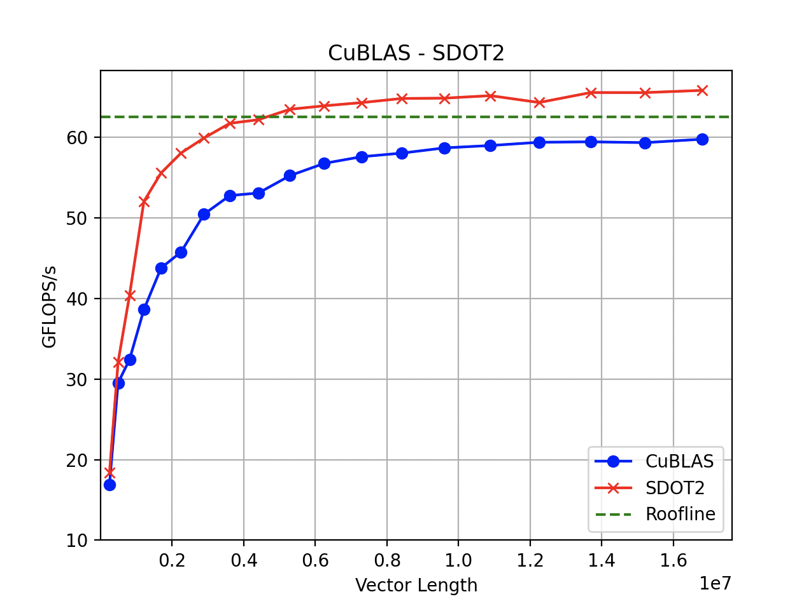

# Optimized-Cuda-SDOT-Kernel-on-NVIDIA-Turing-GPUs
An optimized CUDA SDOT(Single Floating-Point DOT Product) kernel on NVIDIA Turing GPUs. Better performance than the cuBLAS kernel.
## Description

This code demonstrates a usage of cuBLAS `SDOT` function to apply the dot product to vector x and y

Optimization of operations like SDOT in High-Performance Computing (HPC) mainly revolves around reducing data movement. This is achieved on GPU platforms by leveraging parallelism, reusing data at the cache/register level, and utilizing manual prefetching. 

By testing, this GPU-optimized kernel boosts the efficiency of the SDOT operation by minimizing data movement, which runs faster than the cuBLAS SDOT kernel.

Any discussions are welcome, please send them to yiliuli2006@gmail.com

#Logic
## Kernel 1 
The `kernel 1` uses the traditional sequential reduction. Specifically, after multiplying numbers on each position, this kernel adds up two products at a thread in a time, with stride `Size of Vector / 2`. 
Shown as below. 


## Kernel 2
The `kernel 1` uses a optimised sequential reduction. In specific, after multiplying numbers on each position, the `kernel 2` adds up four products at a thread in a time, with stride `Size of Vector / 4`. 
Shown as graph below. 


In comparison, `kernel 2` requires less data movement, whereas the time of iteration is shortened, more tasks are allocated to the GPU computing unit. As a consequense, enhanced the performance limit.


# Performance
The following test results was produced on:
- GCC Version 4.8.5
- CentOS Linux 7.9.2009
- 8 Tesla T4 with CUDA Version 11.4

### Performance Comparison Between CuBLAS and Kernel 1 


### Performance Comparison Between CuBLAS and Kernel 2 


### Performance Comparison Between Kernel1 and Kernel 2


# How to run
- Clone the code.
- Build command in terminal.
    ```bash
$ mkdir build
$ cd build
$ cmake ..
$ make
```
- Run the executable file.
```bash
  ./cuda_sdot
```
- Enter kernel number (0 for ).
- Enter block-size ( 64 / 256 recommended ).

------------

## Kernel List
### Kernel 1
This kernel operate traditionally, 


### Kernel 2
### Kernel 3
### Kernel 4


